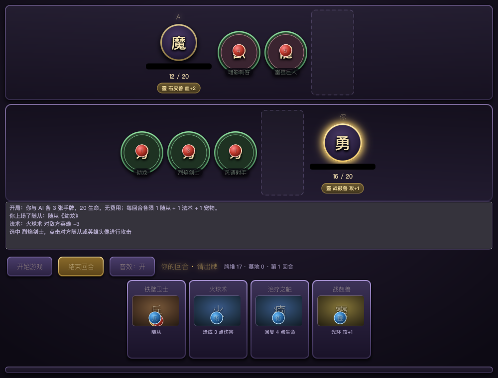

# CardGame · 卡牌对战

一个炉石风格的卡牌对战游戏（玩家 vs AI），暗色奇幻美术风格，Java + JavaFX 实现。



## 下载游玩（Windows）

**➡️ [点此下载最新版](https://github.com/pvehbo/card-game/releases/latest)**

下载 `CardGame-<版本>-windows-x64.exe`，双击安装即可开始游戏。

- 仅支持 Windows 64 位
- **已内置运行环境，无需安装 Java**
- 安装后桌面和开始菜单会有快捷方式

## 玩法规则

双方英雄各有 **20 点生命**，先把对方打到 0 者获胜。

每回合可做这些事（每项各限 1 次）：

| 操作 | 说明 |
|---|---|
| **出 1 张随从** | 上场后可以攻击（刚上场当回合**不能**攻击，叫「召唤失调」） |
| **用 1 张法术** | 造成伤害 / 回复生命 / 抽牌 |
| **召唤 1 只宠物** | 不可攻击、不可被攻击，提供**常驻光环**：给己方全体随从加攻或加血 |

- 随从互相攻击时**双方同时受伤**，血量归零即阵亡
- **每个随从每回合只能攻击 1 次**：出过手的随从会压暗并标上「已动」，下回合才能再出手
- 对方场上没有随从时，可以直接攻击对方英雄
- 场上最多 7 个随从，手牌上限 10 张

## 操作方法

1. 点 **「开始游戏」** 开局（随机决定先后手）
2. **出牌**：点击手牌区任意一张卡
3. **攻击**：先点自己的随从（会高亮），再点**对方的随从**或**对方的英雄头像**
4. **结束回合**：点「结束回合」按钮，交给 AI 行动
5. **音效**：点「音效：开 / 关」按钮可随时静音（合成音效对老机器也有开销时尤其有用）

界面提示：
- 显示 `Zzz` 的随从表示召唤失调，本回合不能攻击
- 金色外圈 = 你的回合；红色外圈 = 可攻击目标
- 轮到谁，谁的头像会缓慢「呼吸」放大

## AI 对手

内置的 AI 会：
- 上场攻击力最高的随从
- 生命值低于 10 时优先治疗
- 优先攻击你血量最低的随从，你场上没随从时直接打脸
- 发现能斩杀时立刻使用伤害法术

AI 的回合是**逐动作演出**的：抽牌 → 出牌 → 逐个随从出手，每个动作之间留出间隔，
你能看清它做了什么，而不是一瞬间全部结算完。

## 打击感与音效

界面表现全部是代码生成的，**不需要任何音频/图片素材**：

| 效果 | 触发时机 |
|---|---|
| **程序化音效** | 抽牌 / 上场 / 施法 / 召唤宠物 / 攻击 / 受伤 / 阵亡 / 回合开始 / 胜 / 负，共 10 种，用 `javax.sound` 实时合成波形 |
| **卡牌飞入** | 出牌时手牌快照沿弧线飞向落点；法术还会拖一条粒子尾迹 |
| **攻击突刺** | 随从朝目标冲出去再回位，撞击瞬间迸发火花并轻微抖屏 |
| **伤害飘字** | 受击目标上方浮起红色数字（治疗为绿色 `+N`），随从挨打飘在随从头上、英雄挨打飘在头像上 |
| **粒子层** | 独立 Canvas 全屏覆盖、鼠标穿透，60fps 自绘：上场绿火、受伤橙火、阵亡紫色消散、胜利尘埃 |
| **翻面 / 入场动画** | 新随从绕 Y 轴翻转登场，新抽到的牌从牌堆方向滑入 |

实现说明：
- 音效在启动时由后台线程预热成 `Clip` 池（每种 4 个实例，避免并发播放互相打断）；
  没有可用音频设备时自动静默降级，不影响游戏。
- 所有动效都**不影响游戏逻辑**：结算仍然由引擎决定，动画只是在事件之后播放。
- 想关掉某一类效果，直接改 `src/main/resources/app.css` 或 `ui/fx/` 下的常量即可。

## 本地运行（开发）

需要 **JDK 17+** 和 **Maven**。

```bash
# 直接运行
mvn javafx:run

# 跑测试
mvn test
```

### 诊断用启动参数

游戏内置两个诊断开关：`-Dui.screenshot=<路径>`（构造演示局面并截图后退出）和
`-Dui.autoplay=<回合数>`（程序自己跟 AI 打完若干回合，战报同步打印到控制台）。

注意 **`mvn javafx:run` 不会把命令行的 `-D` 透传给游戏进程**，要带参数请直接 `java` 启动：

```bash
# 导出依赖 classpath（一次即可）
mvn -o dependency:build-classpath -Dmdep.outputFile=target/cp.txt

# README 顶部的截图就是这么生成的
java -Dui.screenshot=docs/screenshot.png \
     -cp "target/classes:$(cat target/cp.txt)" org.example.card.ui.Main

# 整局流程冒烟测试：自动打 10 个回合
java -Dui.autoplay=10 \
     -cp "target/classes:$(cat target/cp.txt)" org.example.card.ui.Main

# 叠加使用：自动打完 10 回合后截图
java -Dui.autoplay=10 -Dui.screenshot=target/after.png \
     -cp "target/classes:$(cat target/cp.txt)" org.example.card.ui.Main
```

## 打包

**macOS / Linux：**
```bash
./package.sh
```
产物在 `target/pkg/output/`。

**Windows：**
```bat
package.bat
```
产物在 `target\pkg\output\`。

两个脚本都会用 `jlink` 构建**精简运行时**（只打包游戏需要的 10 个模块，而非整个 JDK），再交给 `jpackage` 生成免安装的应用程序。

## 自定义卡图与美术

游戏支持直接替换图片资源。把图片放进 `src/main/resources/images/` 对应目录即可自动生效，无需改代码：

```
images/
├── cards/         卡图（按卡牌 id 或名称命名，如 m1.png / 幼龙.png）
├── heroes/        英雄头像（player.png / ai.png）
└── backgrounds/   战场背景（board.jpg）
```

详细规格（尺寸、格式、命名）见 [`src/main/resources/images/README.md`](src/main/resources/images/README.md)。

**没有图片也能正常运行** —— 会自动回退到内置的程序化图形。

## 技术栈

- **Java 17** + **JavaFX 21**（界面）
- **Maven**（构建）
- **JUnit 5**（规则引擎单元测试）
- 架构分层：`model`（数据）/ `engine`（规则）/ `ai`（AI）/ `event`（事件总线）/ `ui`（界面）
- 音效零依赖：`javax.sound.sampled`（内置 `java.desktop`）实时合成波形，不打进任何音频文件

引擎通过**事件总线**发布游戏事件（抽卡、上场、攻击、受伤、阵亡、回合切换、胜负），界面只订阅事件做表现，两者完全解耦 —— 便于后续持续扩展新玩法。

事件里带着界面需要的锚点信息：例如受伤事件会区分「英雄受伤」和「随从受伤」
（`target` = 所属玩家，`defender` = 具体随从），所以飘字和粒子能落在正确的目标上。

## 项目结构

```
src/main/java/org/example/card/
├── model/     卡牌与玩家数据模型（Card / MinionCard / SpellCard / PetCard / PlayerState / Deck）
├── engine/    游戏规则引擎（GameEngine 处理回合、出牌、战斗结算）
├── ai/        AI 决策（SimpleAi）
├── event/     事件总线（GameEvent / GameEventBus）
└── ui/        JavaFX 界面（CardGameApp / CardView / MinionView / HeroView / Assets / Fonts）
    └── fx/    打击感工具箱（Fx 动画 / ParticleLayer 粒子 / SoundEngine + Sfx 音效）
```
