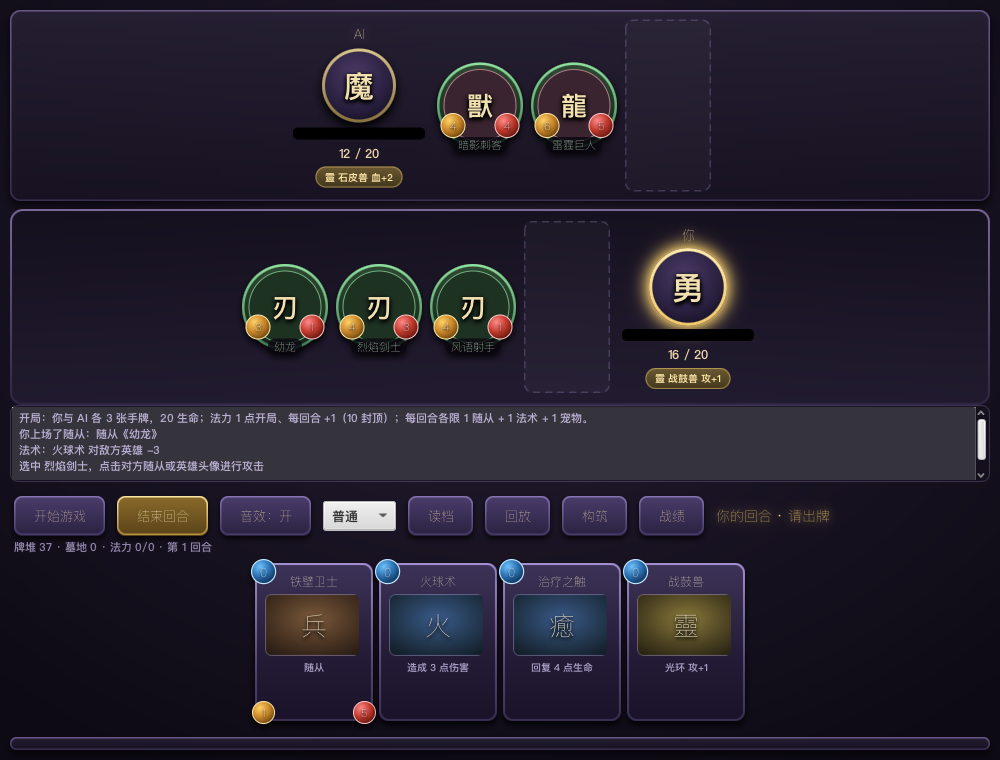

# CardGame · 卡牌对战

一个炉石风格的卡牌对战游戏（玩家 vs AI），暗色奇幻美术风格，Java + JavaFX 实现。
30 种卡牌、7 个关键词、三档 AI、可构筑牌组、可存档回放。



## 下载游玩

**➡️ [点此下载最新版](https://github.com/pvehbo/card-game/releases/latest)**

| 系统 | 文件 | 说明 |
|---|---|---|
| Windows 64 位 | `CardGame-<版本>-windows-x64.exe` | 双击安装，桌面和开始菜单会有快捷方式 |
| macOS | `CardGame-<版本>.dmg` | 拖进应用程序即可 |
| Linux | `cardgame_<版本>_amd64.deb` | `dpkg -i` 安装 |

- **已内置运行环境，无需安装 Java**
- 普通推 main 只出 CI artifact；推 `v*` tag 才发 Release（见 `.github/workflows/`）。

## 玩法规则

双方英雄各有 **20 点生命**，先把对方打到 0 者获胜。

**法力**：1 点开局，每回合上限 +1（10 封顶）并回满；所有出牌都要付费。

每回合可做这些事（每项各限 1 次，且法力要够）：

| 操作 | 说明 |
|---|---|
| **出 1 张随从** | 上场后可以攻击（刚上场当回合**不能**攻击，叫「召唤失调」；**冲锋**除外） |
| **用 1 张法术** | 造成伤害 / 回复生命 / 抽牌 |
| **召唤 1 只宠物** | 不可攻击、不可被攻击，提供**常驻光环**：给己方全体随从加攻或加血（也有扣血的双刃剑） |

关键词（卡面描述里标出）：

| 关键词 | 效果 |
|---|---|
| **冲锋** | 上场当回合即可攻击 |
| **嘲讽** | 对方必须先攻击它（打脸会被拦下并提示）；金色厚边框标识 |
| **战吼 / 亡语** | 上场 / 阵亡时触发 |
| **圣盾** | 抵消下一次受到的伤害（左上角“盾”字） |
| **风怒** | 每回合可攻击 2 次 |
| **剧毒** | 对随从造成伤害即摧毁（圣盾能挡下） |

- 随从互相攻击时**双方同时受伤**，血量归零即阵亡
- **每个随从每回合只能攻击 1 次**（风怒 2 次）：出完手的随从会压暗并标上「已动」
- 对方场上有嘲讽时不能打脸；没有随从（且无嘲讽）时可以直接攻击对方英雄
- 场上最多 7 个随从，手牌上限 10 张

## 操作方法

1. 点 **「开始游戏」** 开局（随机决定先后手）
2. **出牌**：点击手牌区任意一张卡（费用不够置灰）
3. **攻击**：先点自己的随从（会高亮），再点**对方的随从**或**对方的英雄头像**
4. **结束回合**：点「结束回合」按钮，交给 AI 行动
5. **音效**：点「音效：开 / 关」按钮可随时静音（选择会落盘记住）
6. **难度**：下拉框随时切换简单 / 普通 / 困难
7. **构筑**：点「构筑」组 30 张牌组（同名 ≤2，明星单卡 ≤1，带费用曲线），下局生效
8. **读档 / 回放**：每回合自动存档，点「读档」续玩；点「回放」步进复盘（可播放/暂停/退出）
9. **战绩**：点「战绩」看胜率统计与 8 个成就

界面提示：
- 显示 `Zzz` 的随从表示召唤失调，本回合不能攻击
- 金色外圈 = 你的回合；红色外圈 = 可攻击目标；金色厚边框 = 嘲讽
- 轮到谁，谁的头像会缓慢「呼吸」放大

## AI 对手

三档可选（下拉框一局内可换，诊断可用 `-Dai.level=easy|normal|hard` 预设）：

| 难度 | 打法 |
|---|---|
| 简单 | 随机合法动作 |
| 普通 | 贪心：上最高攻随从、低血回血、打最低血随从、能斩杀用法术 |
| 困难 | 贪心 + 斩杀直觉：有随从能打脸斩杀就全员打脸 |

三档共用同一套合法动作表（费用不够的牌不会选，有嘲讽自动解嘲讽）。

AI 的回合是**逐动作演出**的：抽牌 → 出牌 → 逐个随从出手，每个动作之间留出间隔，
你能看清它做了什么，而不是一瞬间全部结算完。

## 打击感与音效

界面表现全部是代码生成的，**不需要任何音频/图片素材**：

| 效果 | 触发时机 |
|---|---|
| **程序化音效** | 抽牌 / 上场 / 施法 / 召唤宠物 / 攻击 / 受伤 / 阵亡 / 回合开始 / 胜 / 负，共 10 种，用 `javax.sound` 实时合成波形 |
| **卡牌飞入** | 出牌时手牌快照沿弧线飞向落点；法术还会拖一条粒子尾迹 |
| **攻击突刺** | 随从朝目标冲出去再回位，撞击瞬间迸发火花并轻微抖屏 |
| **伤害飘字** | 受击目标上方浮起红色数字（治疗为绿色 `+N`），随从挨打飘在随从头上、英雄挨打飘在头像上 |
| **粒子层** | 独立 Canvas 全屏覆盖、鼠标穿透、60fps 自绘：上场绿火、受伤橙火、阵亡紫色消散、胜利尘埃 |
| **翻面 / 入场动画** | 新随从绕 Y 轴翻转登场，新抽到的牌从牌堆方向滑入 |

实现说明：
- 音效在启动时由后台线程预热成 `Clip` 池（每种 4 个实例，避免并发播放互相打断）；
  没有可用音频设备时自动静默降级，不影响游戏。
- 所有动效都**不影响游戏逻辑**：结算仍然由引擎决定，动画只是在事件之后播放。
- 想关掉某一类效果，直接改 `src/main/resources/app.css` 或 `ui/fx/` 下的常量即可。

## 本地运行（开发）

需要 **JDK 17+** 和 **Maven**。

```bash
# 直接运行
mvn javafx:run

# 跑测试（97+ 用例，含规则/体检/天梯基准）
mvn test
```

### 诊断用启动参数

游戏内置诊断开关：`-Dui.screenshot=<路径>`（构造演示局面并截图后退出）、
`-Dui.autoplay=<回合数>`（程序自己跟 AI 打完若干回合，战报同步打印到控制台）、
`-Dai.level=easy|normal|hard`（预设 AI 难度）、`-Dcardgame.home=<目录>`（覆盖数据目录）。

注意 **`mvn javafx:run` 不会把命令行的 `-D` 透传给游戏进程**，要带参数请直接 `java` 启动：

```bash
# 导出依赖 classpath（一次即可）
mvn -o dependency:build-classpath -Dmdep.outputFile=target/cp.txt

# README 顶部的截图就是这么生成的
java -Dui.screenshot=docs/screenshot.png \
     -cp "target/classes:$(cat target/cp.txt)" org.example.card.ui.Main

# 整局流程冒烟测试：自动打 10 个回合
java -Dui.autoplay=10 \
     -cp "target/classes:$(cat target/cp.txt)" org.example.card.ui.Main
```

用户数据（配置/存档/回放/战绩）默认在 `~/.cardgame/`，损坏自动降级不炸游戏。

## 打包

**macOS / Linux：**
```bash
./package.sh
```
产物在 `target/pkg/output/`。

**Windows：**
```bat
package.bat
```
产物在 `target\pkg\output\`。

`package.sh` 用 `jpackage` 生成自包含应用；Windows CI 额外用 `jlink` 构建精简运行时。

## 自定义卡牌与美术

**加新卡不用改代码**：往 `src/main/resources/cards/*.json` 加一行即可，启动时严格校验
（id 唯一、数值范围、关键词合法，报错精确到文件行号）：

```json
{"id": "m12", "name": "淬毒幼蛇", "text": "剧毒", "attack": 1, "health": 1,
 "cost": 1, "keywords": ["POISONOUS"], "copies": 1}
```

- `copies`：入堆份数（缺省 2，只许 1～2；明星单卡填 1）
- 数值体检：`data/BalanceCheck` 香草公式（随从身材+关键词 ≈ 2×费用+2），超标会在测试里告警；
  超模卡必须配对等副作用（高费/脆皮/负光环），见 [`docs/BALANCE.md`](docs/BALANCE.md)

游戏支持直接替换图片资源。把图片放进 `src/main/resources/images/` 对应目录即可自动生效：

```
images/
├── cards/         卡图（按卡牌 id 或名称命名，如 m1.png / 幼龙.png）
├── heroes/        英雄头像（player.png / ai.png）
└── backgrounds/   战场背景（board.jpg）
```

详细规格（尺寸、格式、命名）见 [`src/main/resources/images/README.md`](src/main/resources/images/README.md)。

**没有图片也能正常运行** —— 会自动回退到内置的程序化图形。

## 技术栈

- **Java 17** + **JavaFX 21**（界面）
- **Maven**（构建）
- **JUnit 5**（110 用例：规则引擎 / 数值体检 / AI 天梯基准 / 存档兼容）
- 架构分层：`model`（数据）/ `engine`（校验/结算/会话/回合）/ `effect`（效果注册表+触发器）
  / `data`（卡库/体检/构筑）/ `ai`（策略接口+快照+三档）/ `event`（版本化事件总线）
  / `service`（存档/配置/日志/国际化/统计/回放）/ `ui`（MVVM：VM + 视图 + 演出导演）
- 音效零依赖：`javax.sound.sampled`（内置 `java.desktop`）实时合成波形，不打进任何音频文件

引擎通过**事件总线**发布游戏事件（抽卡、上场、攻击、受伤、阵亡、回合切换、胜负），界面只订阅事件做表现，两者完全解耦 —— 加新玩法只需加 Effect/Trigger 实现 + JSON。

事件带版本（`EVENT_SCHEMA`）可序列化：存档、回放、天梯、将来联机走的都是同一套事件 JSON。

## 项目结构

```
src/main/java/org/example/card/
├── model/       卡牌与玩家数据模型（Card / MinionCard / SpellCard / PetCard / PlayerState / Deck / Keyword）
├── engine/      规则内核（ActionValidator / CombatResolver / GameSession / TurnController / GameEngine）
├── effect/      效果与触发（Effect / EffectRegistry / TriggerSystem / Damage-Heal-DrawEffect）
├── data/        卡库与体检（CardDatabase / MiniJson / BalanceCheck / DeckBuilder）
├── ai/          AI（AiStrategy / AiLevel / SimpleAi / RandomAi / HardAi / GameView）
├── event/       版本化事件（GameEvent / GameEventBus）
├── service/     基础服务（SaveService / ConfigService / GameLog / I18n / StatsService / ReplayRecorder / UserData）
└── ui/          JavaFX 界面（CardGameApp / AiTurnDirector / viewmodel.BoardViewModel）
    ├── view/    视图（BoardView / CardView / MinionView / HeroView / DeckBuilderView / StatsView）
    └── fx/      打击感工具箱（Fx 动画 / ParticleLayer 粒子 / SoundEngine + Sfx 音效）
```

版本记录见 [`docs/CHANGELOG.md`](docs/CHANGELOG.md)，数值规范见 [`docs/BALANCE.md`](docs/BALANCE.md)。
