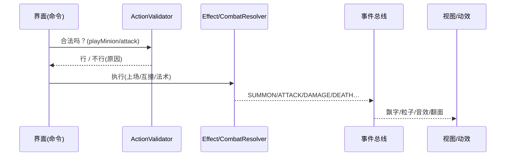

# CardGame · 成熟化计划书（可直接执行）

> 基线：Java 17 + JavaFX 21 + Maven，PvE 炉石式对战（20 血 / 每回合限打 1 随从 + 1 法术 + 1 宠物 / 7 格战场 / 10 张手牌上限）。
> 本计划的目标是把当前“可玩原型”演进为**成熟游戏框架**：分层解耦、数据驱动玩法、AI 可替换、资源可降级、三端可发布，每一步都有命令和验收标准，任何时刻都有可玩版本。

## 0. 交付物与阅读顺序

| 交付物 | 路径 | 说明 |
|---|---|---|
| 目标架构图（可交互 HTML） | `docs/archify/cardgame-architecture.html` | 12 个组件：对局内核 / 事件总线 / MVVM 界面 / 数据与发布；3 个导览视角（核心对局回路、AI 回路、数据驱动与发布）。浏览器打开即可缩放、追踪连线、切换主题。 |
| 分阶段落地流程图（可交互 HTML） | `docs/archify/cardgame-rollout.html` | P0 基线 → P1 内核+数据 → P2 表现+发布，含两处止损（门禁红灯停线、冒烟失败回滚）。 |
| 本计划书 | `docs/PLAN.md`（本文件） | 框架 + 扩展 + 兼容 + 步骤 + 设计流程，全部可执行。 |
| 图源数据（JSON） | `docs/archify/*.candidate.json` | 图的精确规格（SHA 见交付记录），改图只改 JSON 后重新 `deliver`。 |

建议顺序：先打开架构图看“终点长什么样”，再看流程图看“先走哪条路”，最后按第 6 章一步步执行。

---

## 1. 现状摸底（实测代码，不是印象）

| 层 | 现有文件 | 规模 | 结论 |
|---|---|---|---|
| 数据 `model/` | `Card / MinionCard / SpellCard / PetCard / PlayerState / Deck` | 共约 300 行 | 干净可用。缺：费用体系（现无费，靠次数限）、关键词/触发器、Buff 有过期概念（现只有宠物永久光环）。 |
| 规则 `engine/` | `GameEngine`（416 行）+ `Phase` | 1 个大类 | **头号风险**：结算、AI 回合编排、玩家操作、光环计算全塞在一个类。后续加 1 个关键词就会牵一发动全身。必须先拆。 |
| AI `ai/` | `SimpleAi`（82 行贪心） | 1 个策略 | 可用但写死：选最高攻随从、10 血以下回血、打最低血随从。缺：策略接口、难度分级、合法动作枚举（现在 UI/引擎各自判断“能不能动”）。 |
| 事件 `event/` | `GameEvent`（record，11 种事件）+ `GameEventBus`（47 行） | 小而精 | **这是全项目最好的设计**，保留并加强：事件不可变、订阅异常隔离。缺：版本号、存档/回放用的序列化。 |
| 界面 `ui/` | `CardGameApp`（1094 行）+ 4 个 View + `fx/`（粒子/动画/合成音效） | 1 个神类 + 工具箱 | **二号风险**：`CardGameApp` 同时是 Application、状态持有者、AI 演出调度器、动画编排器。缺：ViewModel 隔离（现在 View 直读 `PlayerState` 可变列表）、界面单测。 |
| 测试 | `engine/` 下 4 个测试 | 覆盖抽卡/召唤/战斗/AI 步进 | 锁住了 v1 规则，P0 起保护网作用。缺：效果回归、存档兼容、界面冒烟（已有 `-Dui.autoplay` 可补）。 |
| 构建发布 | `package.sh / package.bat`（jlink 精简运行时 + jpackage）+ CI（Windows 打包） | 可出 Windows exe | 缺：mac/Linux 产物、版本号与更新说明自动化。 |

**一句话诊断**：数据层和事件线是对的，`GameEngine` 和 `CardGameApp` 两个神类是唯一的扩展瓶颈。本计划 80% 的工作就是把这两个类拆开，拆完之后加玩法只是“加数据 + 加小类”。

---

## 2. 目标框架（成熟游戏的标准分层）

原则（全部会在验收中检查）：

1. **内核不依赖界面**：`engine / ai / model / event` 零 JavaFX 引用，可在无头环境 `mvn test` 全量验证。
2. **界面不直调结算**：UI 只发“合法动作命令”，只订“不可变事件”；动画播坏了也不影响胜负。
3. **玩法数据驱动**：新卡 = JSON +（可选）1 个 Effect 类；不改结算代码、不改 UI 代码。
4. **AI 与玩家同权**：AI 只能通过与玩家相同的会话接口拿“合法动作表”走子，方便做难度与回放。
5. **任何提交都可玩**：每阶段结束都有 `mvn test` + 自动对局 + 截图三件套证据。

目标包结构（对照架构图，从现有结构自然长出来，不是推倒重写）：

```
org.example.card/
├── model/        现有 6 类保留；新增 Cost（费用，可先恒 0 兼容老卡）、Keyword 枚举、Buff（含回合过期）
├── data/         ★新增：CardDatabase（JSON 加载+校验）、CardSchema（版本）、BalanceCheck（数值体检）
├── engine/       GameEngine 拆分为：
│   ├── TurnController  回合编排（谁先手、抽/主/战/末四阶段推进）
│   ├── ActionValidator  合法动作枚举 + 校验（UI 和 AI 共用同一份“能不能”）
│   ├── CombatResolver   互撞/直击/阵亡结算（纯函数式，输入双方状态输出事件）
│   ├── TriggerSystem    ★新增：战吼/亡语/回合触发器注册与派发（先只接 2～3 个触发点）
│   └── GameSession      对局会话（持双方 PlayerState + 回合数 + 模式 PvE/本地双人）
├── effect/       ★新增：Effect 接口 + EffectRegistry（关键词→实现），法术/战吼全部走注册表
├── ai/           SimpleAi 保留为贪心实现；新增 AiStrategy 接口 + AiLevel（简单/普通/困难参数）
├── event/        保留 GameEventBus；事件加 schemaVersion + toJson（给存档/回放用）
├── service/      ★新增：SaveService（版本化存档）、ConfigService、I18n（先中英 key）、GameLog（文件日志）
├── ui/
│   ├── viewmodel/ ★新增：BoardViewModel（UI 唯一真相源，View 只绑它）
│   ├── view/      现有 View 搬入，只做渲染（CardView/MinionView/HeroView/BoardView）
│   └── fx/        保留 Fx/ParticleLayer/SoundEngine/Sfx（表现层不动，只换调用方为 ViewModel）
└── app/          Main + CardGameApp 瘦身为“组装器”（只负责接线：Session→ViewModel→View→fx）
```

> 为什么不是微服务/ECS？单机卡牌的信息量（手牌 10、战场 7、事件 11 种）用分层 + 事件总线是最省的；
> ECS 是给上万实体的即时制准备的，在这里是过度设计。等哪天要做“全场随机 200 个地雷”再谈。

---

## 3. 架构图导读（打开 `cardgame-architecture.html` 对照看）

- **核心对局回路视角**：`玩家输入 → 界面壳MVVM → 对局会话 → 规则引擎v2 → 事件总线 → 战场视图 → 玩家`。
  任何一次点击都沿这条路走：`ActionValidator` 先说“行/不行”，`CombatResolver/EffectRegistry` 只管算，算完发事件，View 和音效各自订阅。这就是第 2 章原则 1/2 的图形版。
- **AI 回路视角**：`规则引擎 → AI策略族（合法动作）→ 表现层待演出`。
  AI 拿不到任何后门：它看到的动作表和玩家能点的按钮是同一份 `ActionValidator.legalActions()`。
- **数据驱动与发布视角**：`卡牌数据库 → 对局会话 → 基础服务（存档/配置）→ 构建发布`。
  卡牌 JSON 改数值不需要重新理解结算代码；存档带版本号，老存档新版本可读（读不到的字段走默认值 + 警告日志）。

---

## 4. 可扩展设计（加玩法时只加、不改）

### 4.1 效果注册表（关键词/战吼/法术的唯一入口）

```java
public interface Effect {
  String keyword();                       // 如 "CHARGE"（冲锋）、"TAUNT"（嘲讽）
  boolean appliesTo(GameContext ctx);     // 是否满足触发条件
  List<GameEvent> apply(GameContext ctx); // 只产事件，不碰 UI
}
// 注册：EffectRegistry.register(new ChargeEffect());
// 结算：CombatResolver 只调 registry，不写 if-else。
```

新增流程固定 3 步：① JSON 里给卡加 `keywords:["CHARGE"]`；② 加一个 `XxxEffect` 类；③ 加一个单测（触发 + 不触发各 1 例）。**不允许在 `CombatResolver` 里为单卡写特例分支**（Code Review 红线）。

### 4.2 数据驱动卡牌（JSON 是真相，Java 类是载体）

`src/main/resources/cards/minions.json` 示例（`schemaVersion` 必填）：

```json
{ "schemaVersion": 1, "cards": [
  { "id": "m_charge_01", "name": "冲锋幼龙", "attack": 3, "health": 2,
    "keywords": ["CHARGE"], "text": "冲锋：上场当回合即可攻击。" }
]}
```

`CardDatabase` 启动时加载 + 校验（id 唯一、数值区间、关键词必须已注册），校验失败** fail-fast 拒绝启动**并打印是哪张卡哪一行——宁可启动时炸，不让对局中途炸。老卡（无费用）默认 `cost: 0`，与现规则“无费靠次数限”完全兼容，费用体系以后想加时只需把 `ActionValidator` 的“次数限”换成“次数限 + 费用”，JSON 早已就绪。

### 4.3 AI 策略接口（难度 = 参数，不是重写）

```java
public interface AiStrategy {
  Optional<MinionCard> chooseMinion(GameView view);
  Optional<SpellCard> chooseSpell(GameView view);
  Optional<Move> chooseMove(GameView view);   // Move = 合法动作表中的一项
}
// SimpleAi→GreedyAi（保留现有行为，改名即可）；新增 CautiousAi（血量权重+1）、
// AggroAi（打脸权重+1）。难度选择 = 换实现类 + 调权重，一局内可切换。
```

`GameView` 是只读快照（防 AI 手滑改状态，也防 AI 偷看牌堆顺序）。

### 4.4 资源回退链（缺素材也能跑，这是现有优点，要制度化）

`images/cards/<id>.png → images/cards/<名称>.png → 程序化图形`；`heroes/player.png → 默认头像`；
音频：`Clip 池耗尽/无音频设备 → 静默降级 + 日志`（现有行为保留）。
新增资源必须同时满足：① 有文件时生效；② 删掉文件后游戏照常跑。后一条写进测试（删资源跑冒烟）。

### 4.5 存档版本化（兼容性的压舱石）

```json
{ "saveVersion": 2, "turn": 7, "currentSide": "PLAYER",
  "player": { "life": 14, "hand": ["m1","s3"], "field": [...] }, "ai": { ... } }
```

规则：读取时 `saveVersion > 当前版本 → 拒绝并提示升级游戏`；`< 当前版本 → 按版本迁移函数逐级升上来（migrateV1toV2…）+ 警告日志`；未知字段忽略（给未来留余地）。每个版本至少保留 1 个样例存档在 `src/test/resources/saves/` 做回归。

---

## 5. 兼容性设计（好兼容 = 基线不动 + 降级有路）

| 维度 | 基线（不许动） | 策略 |
|---|---|---|
| 语言/框架 | Java 17 LTS、`javafx.version 21.0.5` | 升级 JavaFX 只升补丁位；升大版本需三端冒烟全过才合入 |
| 系统 | Win x64（已发布 exe）→ 补 macOS/Linux | 同一套 jlink 模块 + jpackage，CI 三矩阵；HiDPI 用 JavaFX 默认缩放，不手写像素 |
| 输入 | 鼠标点击 | 快捷键（空格结束回合、Esc 取消选中）只做**加法**；触屏=大点击区，不单独分支 |
| 音频/图片 | 可全缺 | 回退链（4.4）+ 无头可测（`autoplay` 不初始化音频/窗口动画也能跑通逻辑） |
| 存档 | 版本化 JSON | 5 章附录的迁移规则；发版前用上版本存档读一遍 |
| 编码/换行 | UTF-8 / Git 自动换行 | 卡牌 JSON 只用 UTF-8 无 BOM；`pom` 已定 `project.build.sourceEncoding=UTF-8`，保持 |

---

## 6. 完整执行步骤（按周推进，每步都可独立停下）

> 约定：每步结束必须跑通“三件套”再往下走（这就是流程图里的门禁含义）：
> `mvn test`（逻辑）→ 自动对局 10 回合（流程）→ 截图（画面）。
> 任一红灯：停线修，不合入（对应流程图 `门禁失败停线` 节点）。

### P0 · 基线冻结（0.5 天，先有保护网）

| # | 任务 | 命令 / 验收 |
|---|---|---|
| P0-1 | 跑通测试并留底 | `mvn test` 全绿（现有 4 个引擎测试）；把输出存 `docs/baseline-test.log` |
| P0-2 | 跑通自动对局冒烟 | `mvn -o dependency:build-classpath -Dmdep.outputFile=target/cp.txt`（一次即可），然后 `java -Dui.autoplay=10 -cp "target/classes:$(cat target/cp.txt)" org.example.card.ui.Main`，控制台看到 10 回合战报且进程正常退出 |
| P0-3 | 生成基线截图 | `java -Dui.screenshot=docs/baseline.png -cp "target/classes:$(cat target/cp.txt)" org.example.card.ui.Main`；肉眼确认战场、手牌、头像都在 |
| P0-4 | 打 tag | `git tag baseline-v1 && git push --tags`（回滚锚点，对应流程图 `回滚基线` 的“上一个可玩版本”） |

### P1 · 内核拆分 + 数据驱动（3～5 天，最重要的一周）

| # | 任务 | 改动文件 | 验收 |
|---|---|---|---|
| P1-1 | 抽 `ActionValidator` | 新建 `engine/ActionValidator.java`；`GameEngine` 内联判断改为调它；UI 按钮置灰与 AI 走子同源 | 原有 4 测试全绿 + 新增 `LegalActionsTest`（召唤失调/已出手/场满 7 格各 1 例） |
| P1-2 | 抽 `CombatResolver` | 新建 `engine/CombatResolver.java`（互撞+直击+阵亡）；`performAttack/removeDead` 搬迁，原方法只做转发（标 `@Deprecated`，P2 删） | `GameEngineTest/BattleDemoTest` 不动源码全绿（行为一致性证明） |
| P1-3 | 抽 `TurnController` + `GameSession` | 新建 `engine/TurnController.java`、`engine/GameSession.java`；`CardGameApp` 的开局/先后手/代数（`gameGeneration`）逻辑搬入 Session | `autoplay=10` 战报与 P0 语义一致（回合数、胜负判定相同） |
| P1-4 | `Effect` + `EffectRegistry` + 触发点 | 新建 `effect/` 包；先接 2 个触发点：上场时（战吼位）、阵亡时（亡语位）；把现有“DAMAGE/HEAL/DRAW”法术改成前 3 个 Effect 实现 | 新增 `EffectRegistryTest`；老行为测试全绿（重构未改玩法） |
| P1-5 | 卡牌 JSON 化 | 新建 `data/CardDatabase.java` + `src/main/resources/cards/*.json` + Schema 校验；`Deck` 构造改为 `CardDatabase.standardDeck()` | 删 JSON 任一张卡的字段→启动 fail-fast 报错到行；`mvn test` 全绿 |
| P1-6 | AI 接口化 | 新建 `ai/AiStrategy.java` + `ai/GameView.java`（只读）；`SimpleAi` 改实现接口（行为不变）；`GameEngine.chooseAiTarget` 改走 `legalActions` | `AiStepTurnTest/ManualTurnTest` 全绿；新增 `AiNoCheatTest`（AI 改快照抛异常/拿不到牌堆） |
| 门禁 | P1 合入条件 | `mvn test` + `autoplay=10` + 截图对比（与 `docs/baseline.png` 肉眼无回归） | 任一失败→按流程图 `修复重入` 回到 P1-1 |

### P2 · 表现拆分 + 服务 + 发布（3～4 天，收尾见光）

| # | 任务 | 改动文件 | 验收 |
|---|---|---|---|
| P2-1 | `BoardViewModel` | 新建 `ui/viewmodel/`；`CardGameApp` 的 `player/ai/yourTurn/selectedAttacker` 状态搬入 VM；View 只绑 VM 属性 | 界面行为不变（点选手牌→出牌→攻击→结束回合全流程可用）；`CardGameApp` 行数减半以下 |
| P2-2 | View 搬迁 + 事件绑定 | `ui/CardView/MinionView/HeroView` 搬入 `ui/view/`；订阅改从 VM 拿，不直读 `PlayerState` 可变列表 | 同上 + `autoplay` 截图与 P1 一致 |
| P2-3 | 存档/配置/日志/中文 | 新建 `service/SaveService/ConfigService/GameLog` + `resources/i18n/messages_zh.properties`；存档样例进 `src/test/resources/saves/` | 新旧版本存档互读测试绿；删 `images/` 全目录后游戏照常跑（回退链测试） |
| P2-4 | 三端发布 | `.github/workflows/` 加 macOS/Linux 矩阵（复用现有 `package.sh`）；README 下载表补三端链接 | CI 三端全绿；每端跑 1 次 `autoplay=5` 冒烟 |
| P2-5 | 发版 | `docs/CHANGELOG.md` + `git tag v1.1.0` + Release（含三端包 + `baseline.png` 对比 + 战报片段） | 验收 = 流程图 `发布验收` 节点：截图战报留痕 |

**工作量总览**：P0 半天 + P1 约 4 天 + P2 约 3 天 ≈ **1.5～2 周**（一人、兼职则 ×2）。P1-1→P1-3 是关键路径，不可并行；P1-4/5/6 可三线并行（不同文件）；P2-1 必须在 P1 全绿后开始。

---

## 7. 完整设计流程（新玩法从点子到发版只走这条路）

打开 `docs/archify/cardgame-rollout.html` 对照：主路 9 步，异常 2 条（红灯停线、冒烟回滚）。

### 7.1 新卡牌设计流（最常用，举例：加一张“嘲讽”随从）

```
数值卡（策划表：攻/血/费用/关键词）→ JSON 落字 → BalanceCheck 体检（同费曲线±1）
  → 有新关键词？走 7.2；无 → CardDatabase 校验 → 单测（上场/结算各1例）
  → autoplay=10 看 AI 会不会用 → 截图看卡面 → 合入
```

回合内结算时序（对照 `CombatResolver` 实现顺序，UI 动画只跟事件走）：



### 7.2 新机制开发流（举例：加“嘲讽”关键词）

① `Keyword` 加 `TAUNT` → ② 新建 `TauntEffect implements Effect` → ③ `EffectRegistry` 注册 →
④ `ActionValidator` 加规则“有嘲讽随从时必须先打嘲讽”（**唯一允许改旧文件的地方**，且必须配单测）→
⑤ `TargetingTest`（有嘲讽必选嘲讽 / 无嘲讽走老逻辑）→ ⑥ 三件套 → 合入。
红线：禁止在 `CombatResolver` 为单卡写 `if (name.equals(...))`。

### 7.3 AI 调参流

改权重（`CautiousAi/AggroAi` 参数）→ 跑 `autoplay=20` ×5 局 → 统计胜率/平均回合（控制台战报即数据源）→
胜率偏离 45%～55% 则回滚参数。**AI 强弱用参数表达，不用改规则**（规则是玩家和 AI 的共同契约）。

### 7.4 发版流（对应流程图 P2 段）

`mvn test` → 三端 `package` → 每端 `autoplay=5` → 截图 → 写 CHANGELOG → 打 tag → GitHub Release。
冒烟失败 → `git reset --hard <上一个tag>` 回滚（流程图 `回滚基线`），修好重走，不带病发版。

---

## 8. 直接执行速查（贴进终端就能用）

```bash
# 0) 环境（JDK 17 + Maven；JavaFX 由 Maven 自动拉）
java -version && mvn -version

# 1) 测试（每次改完先跑它）
mvn test

# 2) 本地运行
mvn javafx:run

# 3) 自动对局冒烟（10 回合战报打到控制台）
mvn -o dependency:build-classpath -Dmdep.outputFile=target/cp.txt   # 一次即可
java -Dui.autoplay=10 -cp "target/classes:$(cat target/cp.txt)" org.example.card.ui.Main

# 4) 截图（验收画面回归）
java -Dui.screenshot=docs/check.png -cp "target/classes:$(cat target/cp.txt)" org.example.card.ui.Main

# 5) 打包（macOS/Linux；Windows 用 package.bat）
./package.sh   # 产物在 target/pkg/output/
```

---

## 9. 测试策略（金字塔，不搞人海战术）

| 层 | 内容 | 现状→目标 |
|---|---|---|
| 单元 | 结算（互撞/直击/阵亡）、合法动作、Effect 触发/不触发、存档迁移 V1→V2 | 4 个 → 10+ 个，全在 `src/test`，跑秒级 |
| 流程 | `autoplay` N 回合必终局、无异常、无死循环（`AUTOPLAY_STEP_CAP` 已有 400 步上限，保留） | 已有诊断开关 → 再加“胜率统计”小脚本 |
| 画面 | `screenshot` 对比（肉眼）+ 删资源回退跑 | 已有 → 每发版留 1 张对比图 |
| 兼容 | 上版本存档读入、Win/mac/Linux 各跑 5 回合 | 新增，CI 矩阵里做 |

---

## 10. 风险与回滚

| 风险 | 预案 |
|---|---|
| P1 拆分改坏规则 | P1-2/P1-3 要求“老测试不动源码全绿”；绿不了就 revert 该步（小步提交，每步一 commit） |
| 新 Effect 破坏平衡 | `BalanceCheck` 同费曲线告警 + AI 对战胜率 45%～55% 门禁 |
| JavaFX 升级炸三端 | 锁 `21.0.5`；升级单独开分支，三端冒烟全绿才合 |
| scope 蔓延（想加联机/卡牌编辑器） | 本计划**明确不做**：联机对战、卡牌编辑器、排位/天梯放在 v2.0 之后；P2 验收前任何新点子先记 `docs/IDEAS.md`，不插队 |

---

## 附录 A · 接口草稿（开工时直接抄走）

```java
// engine/ActionValidator.java
public final class ActionValidator {
  public static List<Move> legalActions(GameSession s, Side side); // UI 按钮与 AI 共用
  public static Optional<String> rejectReason(GameSession s, Move m); // “为什么不行”给界面提示
}
// engine/CombatResolver.java —— 纯函数：输入状态，输出事件；不碰 JavaFX
public final class CombatResolver {
  public static List<GameEvent> strike(...);
  public static List<GameEvent> resolveSpell(...);
}
```

## 附录 B · 第一周 commit 建议（每步可独立 revert）

1. `chore: freeze baseline (tag baseline-v1)`
2. `refactor: extract ActionValidator (no behavior change)`
3. `refactor: extract CombatResolver (no behavior change)`
4. `refactor: extract TurnController+GameSession`
5. `feat: EffectRegistry + 3 spell effects`
6. `feat: CardDatabase JSON + validation`
7. `feat: AiStrategy interface (SimpleAi unchanged behavior)`

> 判据：2～4 的 commit diff 里**不允许出现数值变化**（essage/伤害数字/血量），只允许搬家；5～7 才允许加新行为，且每个必须带测试。
